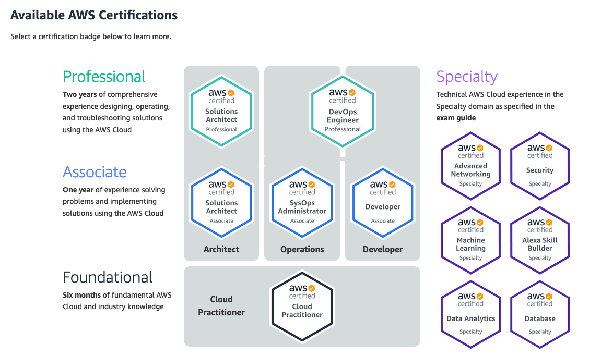

## About AWS Certifications

AWS Certification validates cloud expertise to help professionals highlight in-demand skills and organizations build effective, innovative teams for cloud initiatives using AWS. Choose from diverse certification exams by role and specialty designed to empower individuals and teams to meet their unique goals.

Explore our role-based certifications for those in Cloud Practitioner, Architect, Developer, and Operations roles, as well as our Specialty certifications in specific technical areas.

